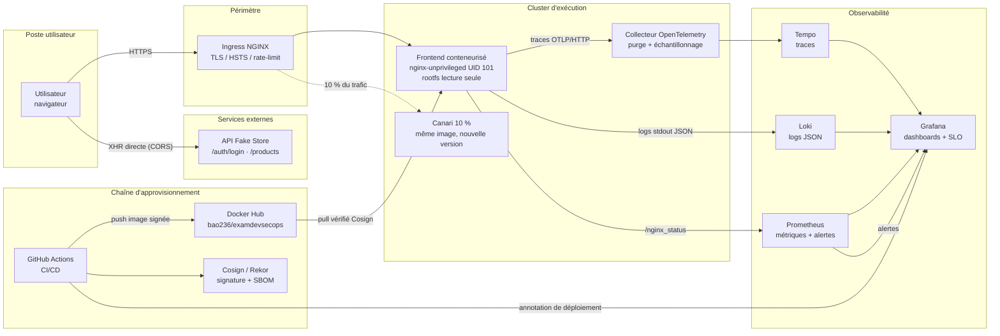
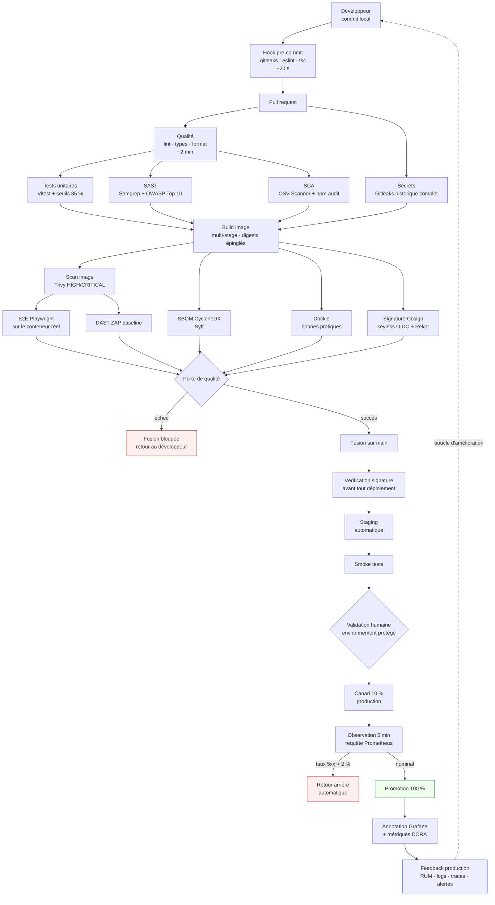

# Diagrammes — architecture et chaîne de valeur

## 1. Architecture cible

**Points de lecture.**

- Le navigateur appelle l'API Fake Store **directement**. C'est une contrainte du
  sujet (API publique tierce), pas un choix : elle impose que le jeton transite par
  le navigateur. La cible corrigée est décrite au §10 du rapport (BFF).
- Le frontend n'a **qu'une seule sortie réseau autorisée** : le collecteur OTel.
  Tout le reste est refusé par la `NetworkPolicy` de refus par défaut.
- Le registre n'est jamais consommé sans vérification : le job `verify-artifact`
  refuse une image dont la signature Cosign n'est pas valide.

---

## 2. Chaîne de valeur — du commit au feedback de production

---

## 3. Où intervient chaque contrôle de sécurité

```mermaid
flowchart LR
    subgraph P1["Code"]
        S1["Gitleaks<br/>secrets"]
        S2["ESLint security<br/>+ règles Semgrep maison"]
    end
    subgraph P2["Dépendances"]
        S3["OSV-Scanner"]
        S4["npm audit --omit=dev"]
        S5["Dependabot hebdomadaire"]
    end
    subgraph P3["Artefact"]
        S6["Trivy image"]
        S7["Dockle"]
        S8["SBOM CycloneDX"]
        S9["Cosign + Rekor"]
    end
    subgraph P4["Exécution"]
        S10["ZAP baseline"]
        S11["CSP + en-têtes<br/>testés en E2E"]
        S12["rootfs RO · non-root<br/>cap-drop ALL"]
        S13["NetworkPolicy<br/>refus par défaut"]
    end
    subgraph P5["Après livraison"]
        S14["Re-scan quotidien<br/>de l'image en production"]
        S15["Expiration forcée<br/>des dérogations"]
    end

    P1 --> P2 --> P3 --> P4 --> P5
    P5 -.->|nouvelle CVE → ticket| P1
```

Le coût de correction d'un défaut croît d'un ordre de grandeur à chaque étage
franchi. C'est la seule justification du « shift left » : ce n'est pas
d'attraper *plus* de défauts, c'est de les attraper *moins cher*.
